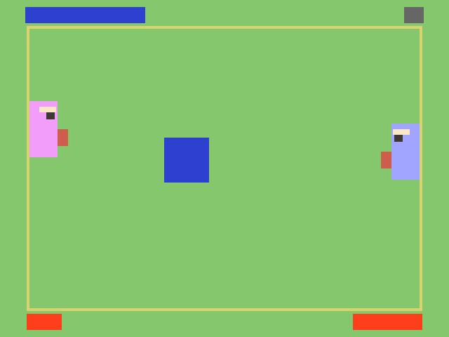

# Spitting Old Men

Author: Oscar(Chunan) Huang

Design: 

    Two old dudes are mad and trying to spit on each other. 
    Spits take time to charge, and longer charge time gives larger spits 
    that do more damage. Small spits do very small damage but are fast and hard to dodge.

Screen Shot:

How To Play:

    Left player: move up/down by pressing "w" and "s" on the keybaord; spit by pressing "d".
    Right player: move up/down by pressing the UP and DOWN arrow on the keybaord; spit by pressing the LEFT arrow.

    The bars on the top indicate the spit charge level. Higher level gives larger spit.
    You cannot spit when it is gray.
    The bar on the bot is the HP bar.

Sources: 

This game is developed on top of the base-code: https://github.com/15-466/15-466-f21-base0
This game was built with [NEST](NEST.md).
